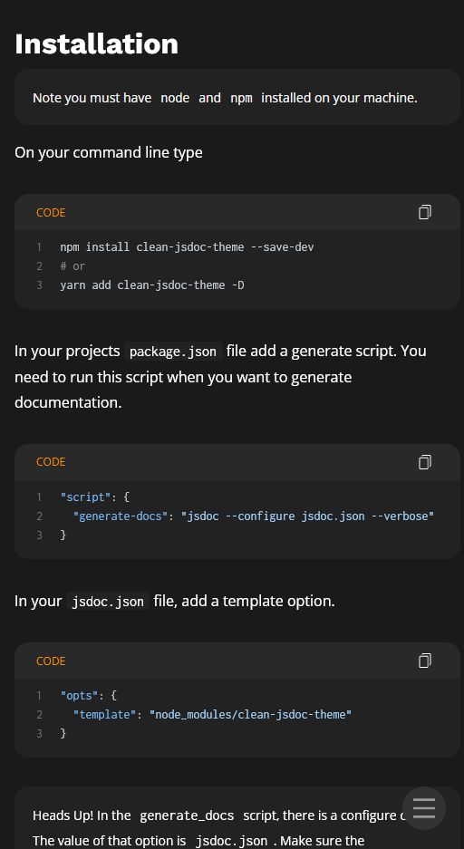

# clean-jsdoc-theme
A clean, responsive template / theme for JSDoc 3. This is created for those who love design. <br>
You can also search in your documenation. This theme / template includes search. It uses fuse.js for search.<br/>
live demo: https://ankdev.me/clean-jsdoc-theme/index.html
### Demo screen




## Install
> Note you must have `npm` installed on your machine.

On your command line type
```bash
npm install clean-jsdoc-theme
```

## Usage
Clone repository to your designated jsdoc template directory, then

```bash
jsdoc entry-file.js -t path/to/clean-jsdoc-theme
```

## Node.js Dependency
In your projects package.json file add a generate script
```json
"script": {
  "generate-docs": "node_modules/.bin/jsdoc --configure .jsdoc.json --verbose"
}
```

In your `jsdoc.json` file, add a template option.

```json
"opts": {
  "template": "node_modules/clean-jsdoc-theme"
}
```


## Example JSDoc Config
```json
{
    "source": {
        "include": ["lib", "package.json", "README.md"],
        "includePattern": ".js$",
        "excludePattern": "(node_modules/|docs)"
    },

    "plugins": [
        "plugins/markdown"
    ],

    "opts": {
        "encoding": "utf8",
        "readme": "./README.md",
        "destination": "docs/",
        "recurse": true,
        "verbose": true,
        "template": "./node_modules/clean-jsdoc-theme"
    }
}
```

## Features
You can pass an object called `theme_opts` under `opts` for more options like:
```javascript
"opts":{
  /*
    Default options
  */
  "theme_opts":{
    "title": "Ankdev", 
    /* 
      Instead of only string you can pass html element like 
      
      Path must be relative to the output file (relative to generated html files.) you 
      can use the absolute path.
      Note: If you use html the default overwrite. Also for custom class you have to create 
      a class using create_style.This is shown below.
    */

   "filter": false, /*  The default value is true. This will turn the color of image white. 
      If you did not want any
      filter set it to false.
   */
  
  
  // You can create custom style which will overwrite the exisiting class property.
  "create_style": "nav{background: yellow}" +     // This will change the background color of sidebar.
                  ".my-custom-class{ filter: brightness(10) grayscale(100%)}", // This will apply filter to my-custom-class
  
  //You can add path of your style file. Note it must be relative to your output file. (relative to generated html files.)
  "add_style_path": ["../custom.css"] // Pass array or path

  // You can add custom script to html
  "add_scripts": "function foo(){console.log('foo')}",

  // You can add path of your script file. Note it must be relative to your output file. (relative to generated html files.)
  "add_script_path": ["../custom.js"] // Pass array or path
  
  "footer": "This is footer",   // Here again you can pass html element 
  }
}
```
If this documentation is not enough feel free to create an issue.

## Developing
```bash 
git clone https://github.com/ankitskvmdam/clean-jsdoc-theme.git
cd clean-jsdoc-theme
npm install
npm run test
```
`npm run test` will generate files in output folder.

## Contact
Mail me at: hello@ankdev.me <br>
If you find any bug or need any feature in the future build feel free to open an issue at github: https://github.com/ankitskvmdam/clean-jsdoc-theme/issues


## License
Licensed under the MIT license.
